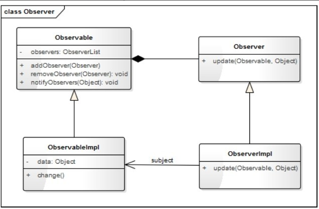
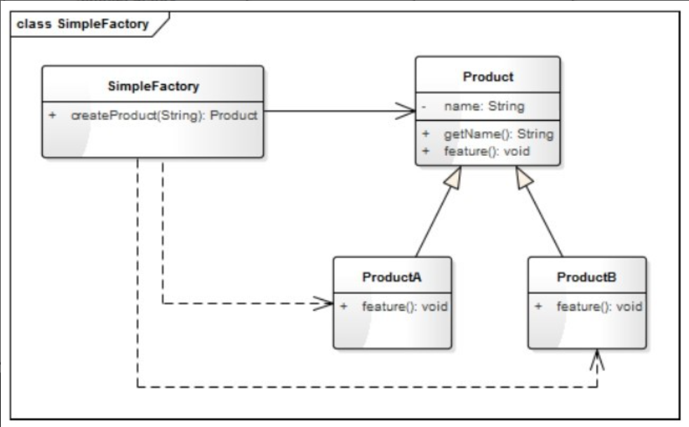
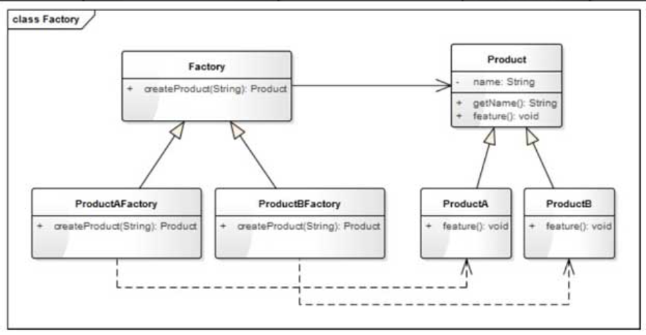
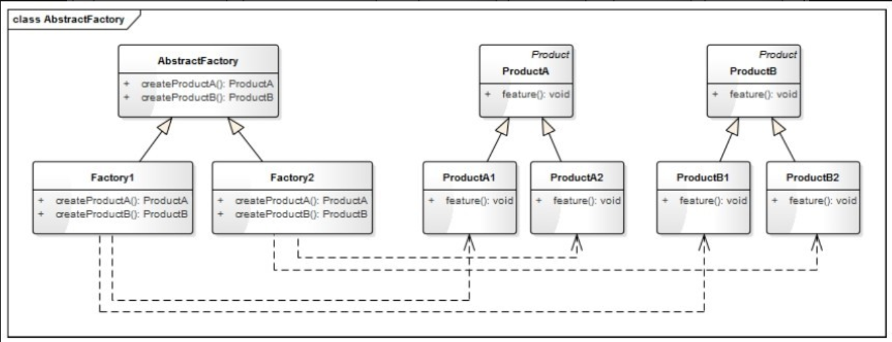

# 设计模式

## 一、监听模式（观察者模式）
目录: `observer_pattern`
### 说明
> 在对象间定义一种一对多的依赖关系，当这个对象状态发生改变时，所有依赖它的对象都会被通知并自动更新。 

>监听模式的核心思想就是在被观察者与观察者之间建立一种自动触发的关系。

### 类图



## 二、工厂模式
目录：`factory_pattern`
## 简单工厂模式
>专门定义一个类来负责创建其他类的实例，根据参数的不同创建不同类的实例，被创建的实例通常具有共同的父类，这个模式叫简单工厂模式（Simple Factory Pattern）。

### 类图

### 优缺点
```
优点：
（1）实现简单、结构清晰。
（2）抽象出一个专门的类来负责某类对象的创建，分割出创建的职责，不能直接创建具体的对象，只需传入适当的参数即可。
（3）使用者可以不关注具体对象的类名称，只需知道传入什么参数可以创建哪些需要的对象。

缺点：
（1）不易拓展，一旦添加新的产品类型，就不得不修改工厂的创建逻辑。不符合“开放封闭”原则，
如果要增加或删除一个产品类型，就要修改switch...case...（或if...else...）的判断代码。
（2）当产品类型较多时，工厂的创建逻辑可能过于复杂，switch...case...（或if...else...）判断会变得非常多。
一旦出错可能造成所有产品创建失败，不利于系统的维护。
```
### 应用场景
（1）产品具有明显的继承关系，且产品的类型不太多。
（2）所有的产品具有相同的方法和类似的属性，使用者不关心具体的类型，只希望传入合适的参数能返回合适的对象。

尽管简单工厂模式不符合“开放-封闭”原则，但因为它简单，所以仍然能在很多项目中看到它。

## 工厂方法模式
> 定义一个创建对象（实例化对象）的接口，让子类来决定创建哪个类的实例。工厂方法使一个类的实例化延迟到其子类。
### 类图

### 优缺点
```
优点：
（1）解决了简单工厂模式不符合“开放-封闭”原则的问题，使程序更容易拓展。
（2）实现简单。
缺点：
对于有多种分类的产品，或具有二级分类的产品，工厂方法模式并不适用。

多种分类：
如我们有一个电子白板程序，可以绘制各种图形，那么画笔的绘制功能可以理解为一个工厂，而图形可以理解为一种产品；
图形可以根据形状分为直线、矩形、椭圆等，也可以根据颜色分为红色图形、绿色图形、蓝色图形等。
二级分类：
如一个家电工厂，它可能同时生产冰箱、空调和洗衣机，那么冰箱、空调、洗衣机属于一级分类；
而洗衣机又可分为高效型的和节能型的，高效型洗衣机和节能型洗衣机就属于二级分类。
```
### 应用场景
（1）客户端不知道它所需要的对象的类。

（2）工厂类希望通过其子类来决定创建哪个具体类的对象。

因为工厂方法模式简单且易拓展，因此在项目中应用得非常广泛，在很多标准库和开源项目中都能看到它的影子。

## 抽象工厂模式
> 提供一个创建一系列相关或相互依赖的对象的接口，而无须指定它们的具体类。
> 
> 抽象工厂模式是工厂方法模式的升级版本，工厂方法模式不能解决具有二级分类的产品的创建问题，抽象工厂模式就是用来解决这一问题的。

### 类图

### 优缺点
```
优点：
解决了具有二级分类的产品的创建。
缺点：
（1）如果产品的分类超过二级，如三级甚至更多级，抽象工厂模式将会变得非常臃肿。
（2）不能解决产品有多种分类、多种组合的问题。
```
### 应用场景
（1）系统中有多于一个的产品族，而每次只使用其中某一产品族。

（2）产品等级结构稳定，设计完成之后，不会向系统中增加新的产品等级结构或者删除已有的产品等级结构。