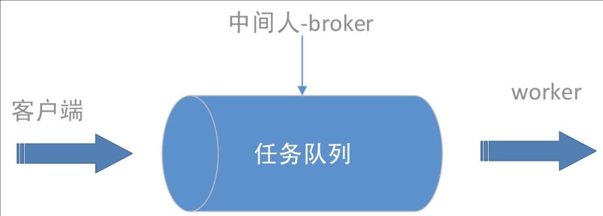
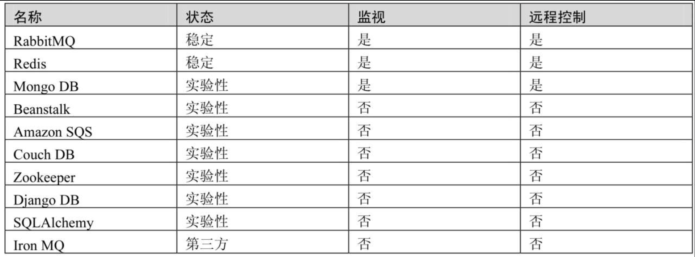

# 一、简介
Celery是由纯Python编写的，但协议可以用任何语言实现。目前，已有Ruby实现的RCelery、Node.js实现的node-celery及一个PHP客户端，语言互通也可以通过using webhooks实现。
### 1.celery概念
**任务队列：** 简单来说，任务队列就是存放着任务的队列，客户端将要执行任务的消息放入任务队列中，**执行节点worker进程持续监视队列**，如果有新的任务，就取出来执行该任务。**这种机制就像生产者、消费者模型一样**，客户端作为生产者，执行节点worker作为消费者，它们之前通过任务队列进行传递，如图所示。

**中间人（broker）：** Celery用于消息通信，通常使用中间人（broker）在客户端和worker之前传递，这个过程从客户端向队列添加消息开始，之后中间人把消息派送给worker。官方给出的实现broker的工具可参见下表。

> 在实际使用中，我们选择RabbitMQ或Redis作为中间人。

**任务生产者：** 调用Celery提供的API、函数、装饰器产生任务并交给任务队列的都是任务生产者。
**执行单元worker：** 属于任务队列的消费者，持续地监控任务队列，当队列中有新的任务时，便取出来执行。
**任务结果存储backend：** 用来存储worker执行任务的结果，Celery支持不同的方式存储任务的结果，包括AMQP、Redis、memcached、MongoDB、SQLAlchemy等。
**任务调度器Beat：Celery Beat进程会读取配置文件的内容，周期性的将配置中到期需要执行的任务发送给任务队列。**

### 2.celery重要特性
**高可用性：** **如果连接丢失或失败，worker和客户端就会自动重试**，并且中间人通过主／主，主／从方式来提高可用性。
**快速：** 单个Celery进程每分钟执行数以百万计的任务，且保持往返延迟在亚毫秒级（使用RabbitMQ、py-librabbitmq和优化过的设置），可以选择多进程、Eventlet和Gevent三种模式并发执行。
**灵活：** Celery几乎所有模块都可以扩展或单独使用。可以自制连接池、序列化、压缩模式、日志、调度器、消费者、生产者、自动扩展、中间人传输或更多。
**框架集成：** Celery易于与Web框架集成，其中的一些甚至已经有了集成包，如**django-celery**、pyramid_celery、celery-pylons、web2py-celery、tornado-celery。因此，学习Celery具有很强的实用价值。
**强大的调度功能：** Celery Beat进程来实现强大的调度功能，可以指定任务在若干秒后或指定一个时间点（datetime类）来运行，也可以基于单纯的时间间隔或支持分钟、小时、每周的第几天、每月的第几天以及每年的第几个月的crontab表达式来使用周期任务调度。
**易监控：** 可以方便地查看定时任务的执行情况，如执行是否成功、当前状态、完成任务花费的时间等，还可以使用功能完备的管理后台或命令行添加、更新、删除任务，提供完善的错误处理机制。