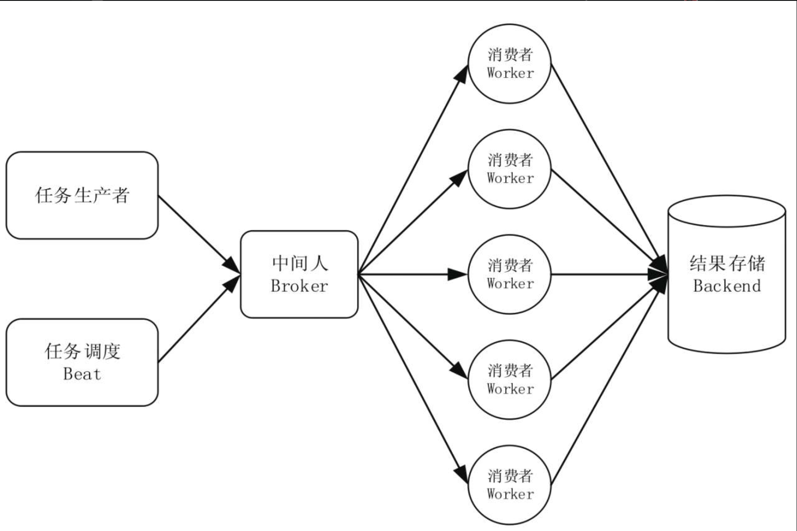

# celery架构

celery完整架构如下：

任务生产者产生任务并将任务发送到中间人

有多个消费者，即执行单元worker持续地监控消息中间人，如有属于自己队列的任务需要执行，就从中间人那里取出作业名称，查找对应的函数代码并执行，执行完成后将结果存储在`Backend`。这里的Worker可以分布式部署，彼此之间是独立的。

任务调度器`Beat：Celery Beat`进程会读取配置文件的内容，周期性地将配置中到期需要执行的任务发送给中间人。