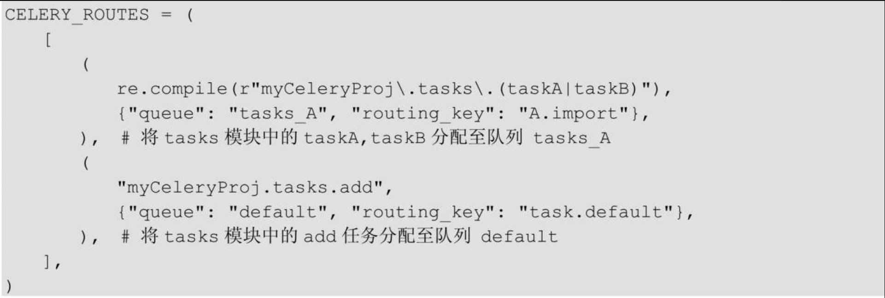

# Celery 队列

Celery非常容易设置和运行，它通常会使用默认名为Celery的队列（可以通过CELERY_DEFAULT_QUEUE修改）来存放任务。Celery支持同时运行多个队列，还可以使用优先级不同的队列来确保高优先级的任务不需要等待就立即得到响应。

我们来实现不同的队列来执行不同的任务：使任务add在队列default中运行；taskA在队列task_A中运行；taskB在队列task_B中运行。

#### celery队列配置

`celery_app/config/celery_config.py`

```python
from kombu import Queue

CELERY_QUEUES = (  # 定义任务队列
    Queue("default", routing_key="task.#"),  # 路由键以“task.”开头的消息都进default队列
    Queue("tasks_A", routing_key="A.#"),  # 路由键以“A.”开头的消息都进tasks_A队列
    Queue("tasks_B", routing_key="B.#"),  # 路由键以“B.”开头的消息都进tasks_B队列
)

CELERY_ROUTES = (
    [
        ("celery_queue_tasks.celery_queue_task.add", {"queue": "default"}),  # 将add任务分配至队列 default
        ("celery_queue_tasks.celery_queue_task.taskA", {"queue": "tasks_A"}),  # 将taskA任务分配至队列 tasks_A
        ("celery_queue_tasks.celery_queue_task.taskB", {"queue": "tasks_B"}),  # 将taskB任务分配至队列 tasks_B
    ],
)
```

#### celery 队列启动

开启三个终端窗口，分别启动三个队列的worker，执行以下命令。

```python
celery -A celery_queue_tasks.start_queue_celery worker -Q default -l info
celery -A celery_queue_tasks.start_queue_celery worker -Q tasks_A -l info
celery -A celery_queue_tasks.start_queue_celery worker -Q tasks_B -l info

# 或者一次启动多个队列
 celery -A celery_queue_tasks.start_queue_celery worker -Q default,tasks_A,tasks_B -P eventlet -c 3 -l info
```

最后开启一个窗口来调用task。

```python
>>> from myCeleryProj.tasks import *
>>> add.delay(4,5);taskA.delay();taskB.delay()
```

**任务的路由：**前述代码中决定任务具体在哪个队列运行（任务的路由）是通过下述代码所指定的。

```python
CELERY_ROUTES = (
    [
        ("celery_queue_tasks.celery_queue_task.add", {"queue": "default"}),  # 将add任务分配至队列 default
        ("celery_queue_tasks.celery_queue_task.taskA", {"queue": "tasks_A"}),  # 将taskA任务分配至队列 tasks_A
        ("celery_queue_tasks.celery_queue_task.taskB", {"queue": "tasks_B"}),  # 将taskB任务分配至队列 tasks_B
    ],
)
```

实际生产环境可能有多个任务需要路由，是否需要逐个去配置呢？当然不需要，批量分配任务到队列可以使用如下方法。


还可以使用正则表达式。 



更改队列默认属性值。

```python
CELERY_TASK_DEFAULT_QUEUE = "default"  # 设置默认队列名为 default
CELERY_TASK_DEFAULT_EXCHANGE = "tasks"
CELERY_TASK_DEFAULT_EXCHANGE_TYPE = "topic"
CELERY_TASK_DEFAULT_ROUTING_KEY = "task.default"
```
